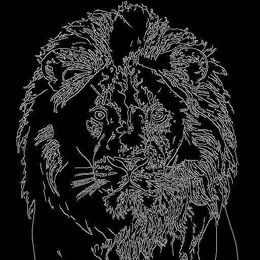
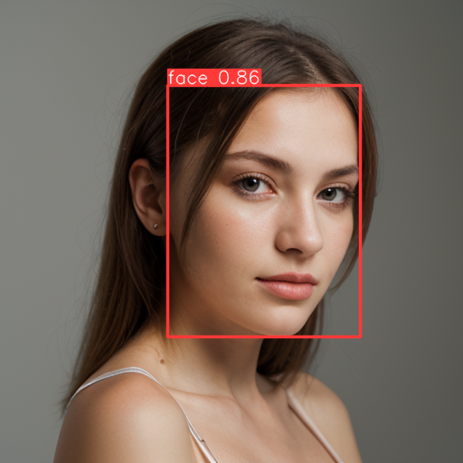

# Stable Diffusion Kotlin API

Kotlin API client for AUTOMATIC1111/stable-diffusion-webui

Currently supports text2image, image2image processes, ControlNet, ADetailer, ReActor extensions.

## Usage

You can create api client instance with custom host, port and protocol. Note that, API support have to be enabled from webui to use this client. You  can check how to enable API from [here](https://github.com/AUTOMATIC1111/stable-diffusion-webui/wiki/API).

```kotlin
val sdWebUiApi = SdWebUi.Builder()
    .host("127.0.0.1")
    .port(7860)
    .useHttps(false)
    .build()
```

### Text2Image

You can use Kotlin DSL builder to create a text2image process with default parameter values.

```kotlin
val result = api.runText2Image {
    prompt("cute dog, high quality")
    negativePrompt("worst quality")
    samplerName("DPM++ 2M Karras")
    steps(25)
}

if (result.isFailure) {
    return println(result.exceptionOrNull())
}

val data = requireNotNull(result.getOrNull())

// Returned images in base64
val images = data.images

// JSON text info about the API call
val info = data.info
```

Or you can use payload model directly with the stable diffusion service. This usage will require to fill all the request parameters.

```kotlin
val payload = Text2ImagePayload(
    prompt = "cute dog, high quality",
    negativePrompt = "worst quality",
    samplerName = "DPM++ 2M Karras",
    steps = 25,
    //... other parameters
)
val result = api.stableDiffusion.text2Image(payload)
```


### Image2Image

You can use Kotlin DSL builder with default parameter values or payload model directly with the stable diffusion service to create a image2image process.

```kotlin
val result = api.runImage2image {
    initImages(listOf(loadImage("input-1.jpg")))
    prompt("masterpiece")
    samplerName("DPM++ 2M Karras")
    steps(25)
}

if (result.isFailure) {
    return println(result.exceptionOrNull())
}

val images = requireNotNull(result.getOrNull()).images
```


## Configuration and Utility APIs

You can use configuration API methods over client services directly. Response of the most of them are wrapped with a data class,
 however some of them returns raw string because of type safety. You can parse them your own.

```kotlin
api.core.getQueue()

api.stableDiffusion.setModel("v1-5-pruned-emaonly.safetensors [6ce0161689]")
api.stableDiffusion.refreshCheckpoints()

api.stableDiffusion.getModels() // v1-5-pruned-emaonly.safetensors [6ce0161689] ...
api.stableDiffusion.getSamplers() // DPM++ 2M Karras, DPM++ SDE Karras ...
api.stableDiffusion.getEmbeddings()
api.stableDiffusion.getVae()
api.stableDiffusion.getLoras() // add_detail ...
api.stableDiffusion.getOptions()
api.stableDiffusion.getCmdFlags()
api.stableDiffusion.getExtensions() // adetailer, sd-webui-controlnet ...
api.stableDiffusion.getHypernetworks()
api.stableDiffusion.getFaceRestorers() // CodeFormer, GFPGAN ...
api.stableDiffusion.getRealesrganModels() // R-ESRGAN General 4xV3, R-ESRGAN General WDN 4xV3 ...
api.stableDiffusion.getPromptStyles()
api.stableDiffusion.getUpscalers() // None, Lanczos, Nearest ...
api.stableDiffusion.getLatentUpscaleModes() // Latent, Latent (antialiased) ...
api.stableDiffusion.getScripts() // txt2img, img2img
api.stableDiffusion.getScriptInfo()
api.stableDiffusion.getProgress()
api.stableDiffusion.getMemory()
```

## Extension Support

There are extensions that we can easily include in the generation process. These plugins work by simply adding their specific arguments to the `alwayson_scripts` parameter.

### ControlNet

`# https://github.com/Mikubill/sd-webui-controlnet`

You can use configuration API below.

```kotlin
api.controlNet.getVersion() // 2
api.controlNet.getModels() // control_canny-fp16 [e3fe7712], control_depth-fp16 [400750f6] ...
api.controlNet.getModules() // none, canny, depth, depth_leres, depth_leres++ ...
api.controlNet.getControlTypes() // none, invert, blur_gaussian, canny ...
api.controlNet.getSettings() // {"control_net_unit_count":3}
```

To use the extension in your process, first you need to describe your ControlNet units.

```kotlin
val controlNetUnit = controlNetUnit {
    inputImage(loadImage("input-2.jpg"))
    module("canny")
    model("control_canny-fp16 [e3fe7712]")
}
```

Then, you can create ControlNet instance and use it in the process builder with its extension function.

```kotlin
val controlNet = controlNet {
    addUnit(controlNetUnit)
}

val result = api.runText2Image {
    prompt("cute dog, high quality")
    negativePrompt("worst quality")
    samplerName("DPM++ 2M Karras")
    steps(25)
    controlNet(controlNet) // Extension-specific extension function.
}

if (result.isFailure) {
    return println(result.exceptionOrNull())
}

val images = requireNotNull(result.getOrNull()).images
```

Alternatively, you can use direct payload model with the stable diffusion service.

```kotlin
val controlNetArgs = ControlNetScriptArgs(
    inputImage = loadImage("input-2.jpg"),
    module = "Canny",
    model = "control_canny-fp16 [e3fe7712]",
    //... other parameters
)
val payload = Text2ImagePayload(
    prompt = "cute dog, high quality",
    negativePrompt = "worst quality",
    samplerName = "DPM++ 2M Karras",
    steps = 25,
    //... other parameters
    alwaysonScripts = mapOf(
        "ControlNet" to listOf(controlNetArgs),
        //... other scripts
    )
)

val result = api.stableDiffusion.text2Image(payload)
```

<table width="100%">
 <tr>
  <td width="33%" style="text-align: center">ControlNet Input</td>
  <td width="33%" style="text-align: center">Canny Model</td>
  <td width="33%" style="text-align: center">Text2Image Output</td>
 </tr>
 <tr>
  <td width="33%" style="text-align: center"></td>
  <td width="33%" style="text-align: center"></td>
  <td width="33%" style="text-align: center"></td>
 </tr>
</table>

### ADetailer

`# https://github.com/Bing-su/adetailer`

To use the extension in your process, you can create ADetailer instance and use it in the process builder with its extension function.

```kotlin
val aDetailer = aDetailer {
    model("face_yolov8n.pt")
    prompt("woman, portrait, high quality, glasses")
}

val result = api.runText2Image {
    prompt("woman, portrait, high quality")
    negativePrompt("worst quality")
    samplerName("DPM++ 2M Karras")
    steps(25)
    aDetailer(aDetailer)
}

if (result.isFailure) {
    return println(result.exceptionOrNull())
}

val images = requireNotNull(result.getOrNull()).images
```

<table width="100%">
 <tr>
  <td width="33%" style="text-align: center">Initial Generation</td>
  <td width="33%" style="text-align: center">Detected Face</td>
  <td width="33%" style="text-align: center">Final Generation</td>
 </tr>
 <tr>
  <td width="33%" style="text-align: center"></td>
  <td width="33%" style="text-align: center"></td>
  <td width="33%" style="text-align: center"></td>
 </tr>
</table>

### ReActor

`# https://github.com/Gourieff/sd-webui-reactor`

You can use configuration API below.

```kotlin
api.reActor.getModels() // inswapper_128.onnx ...
api.reActor.getUpscalers() // None, Lanczos, Nearest, ESRGAN_4x ...
```

To use the extension in your process, you can create ReActor instance and use it in the process builder with its extension function.

```kotlin
val reActor = reActor {
    image(loadImage("input-3.jpg"))
    upscalerName("ESRGAN_4x")
}

val result = api.runText2Image {
    prompt("woman, wizard, portrait, high quality")
    negativePrompt("worst quality")
    samplerName("DPM++ 2M Karras")
    steps(25)
    reActor(reActor)
}

if (result.isFailure) {
    return println(result.exceptionOrNull())
}

val images = requireNotNull(result.getOrNull()).images
```

<table width="100%">
 <tr>
  <td width="33%" style="text-align: center">Initial Generation</td>
  <td width="33%" style="text-align: center">ReActor Input</td>
  <td width="33%" style="text-align: center">Final Generation</td>
 </tr>
 <tr>
  <td width="33%" style="text-align: center"></td>
  <td width="33%" style="text-align: center"></td>
  <td width="33%" style="text-align: center"></td>
 </tr>
</table>

## Installation

```kotlin
// project build.gradle
repositories {
 ....
 maven { url 'https://jitpack.io' }
}

// module build.gradle
dependencies { 
    ...
    implementation("com.github.ibrahimsn98:sdwebui-kotlin:1.0.0")
}
```

## Roadmap

- [ ] Authentication support.
- [ ] Roop extension support.
- [ ] Image upscaling support.
- [ ] Web UI scripts support.
- [ ] RemBG extension support.
- [ ] SegmentAnything extension support.
- [ ] Interrogate support.

## References

- Stable Diffusion Web UI: https://github.com/AUTOMATIC1111/stable-diffusion-webui
- Sdwebui Python Client: https://github.com/mix1009/sdwebuiapi

## License

```
MIT License

Copyright (c) 2024 İbrahim Süren

Permission is hereby granted, free of charge, to any person obtaining a copy
of this software and associated documentation files (the "Software"), to deal
in the Software without restriction, including without limitation the rights
to use, copy, modify, merge, publish, distribute, sublicense, and/or sell
copies of the Software, and to permit persons to whom the Software is
furnished to do so, subject to the following conditions:

The above copyright notice and this permission notice shall be included in all
copies or substantial portions of the Software.

THE SOFTWARE IS PROVIDED "AS IS", WITHOUT WARRANTY OF ANY KIND, EXPRESS OR
IMPLIED, INCLUDING BUT NOT LIMITED TO THE WARRANTIES OF MERCHANTABILITY,
FITNESS FOR A PARTICULAR PURPOSE AND NONINFRINGEMENT. IN NO EVENT SHALL THE
AUTHORS OR COPYRIGHT HOLDERS BE LIABLE FOR ANY CLAIM, DAMAGES OR OTHER
LIABILITY, WHETHER IN AN ACTION OF CONTRACT, TORT OR OTHERWISE, ARISING FROM,
OUT OF OR IN CONNECTION WITH THE SOFTWARE OR THE USE OR OTHER DEALINGS IN THE
SOFTWARE.
```